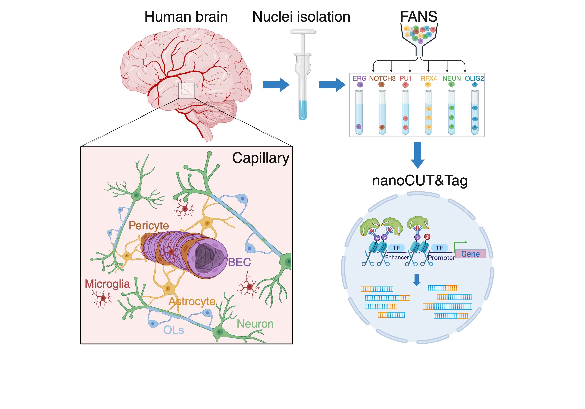

# VascEpigenDementia

### ***Title***: **The brain neurovascular epigenome and its association with dementia**
 
Kevin Chris Ziegler¹²⁸, Aydan Askarova¹²⁸, Charbel Gergian¹², Reuben M. Yaa¹², Janis Lisa Transfeld¹², Janna D. van Dalen¹², Jia Du¹²³, Daniel Clode¹², Fatemeh Rahbar¹², Filippo Zoppi⁴, David D. Gonda⁵, Michael L. Levy⁵, Sven Falk⁴, Marisa Karow⁴, Paul M. Matthews¹², Nicole G. Coufal⁶⁷, Alexi Nott*¹² 
 
1 UK Dementia Research Institute, Imperial College London, London, UK. 
2 Department of Brain Sciences, Imperial College London, London, UK. 
3 Department of Immunology, University of Toronto, Toronto, ON, Canada.  
4  Institute of Biochemistry, Friedrich-Alexander-University Erlangen-Nuremberg, Fahrstrasse 17, 91054 Erlangen, Germany.  
5 Department of Neurosurgery, University of California, San Diego–Rady Children’s Hospital, San Diego, CA 92123, USA.  
6 Department of Pediatrics, University of California, San Diego, La Jolla, CA 92093, USA.  
7 Sanford Consortium for Regenerative Medicine, La Jolla, CA 92037, USA.  
8 These authors contributed equally 
 
*Correspondence: a.nott@imperial.ac.uk 

***Abstract*** 

Small vessel disease (SVD) is frequently comorbid with Alzheimer’s disease (AD) and vascular brain endothelial cells (BECs) are enriched for the expression of genes associated with AD genetic risk. However, the gene regulatory landscapes of neurovascular cells and their intersection with genetic risk for disease remains unexplored. Here we have generated gene regulomes for human BECs, mural cells and other brain cell types to show that AD heritability is primarily immune-related and that it shows modest enrichment in BECs. By contrast, genetic risk for SVD is enriched across cells of the neurovascular unit, including astrocytes. Enhancer-to-gene interactomes implicate amyloid processes in both AD and SVD, though the risk genes are mostly distinct for the two disorders. Motifs for putative partners of lineage transcription factors in microglia and BECs were enriched for AD and SVD variants at genes linked to disease pathways. Gene prioritization and enrichment analyses further identified potential re-purposable drugs and implicate that medications for hypertension may be candidates for AD. Our findings highlight novel regulatory mechanisms and therapeutic targets within the neurovascular system. 
 
***Keywords***
Small vessel disease, Alzheimer’s disease, genetic risk, epigenetics, chromatin looping, fine-mapping, repurposable drugs. 